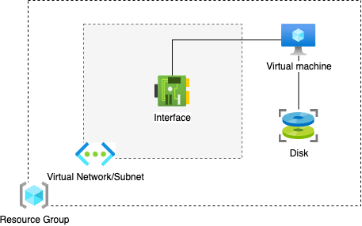

## Getting started with Terraform and Azure

## Getting Terraform

How to install Terraform https://developer.hashicorp.com/terraform/install
How to install Azure CLI https://learn.microsoft.com/en-us/cli/azure/install-azure-cli-windows?tabs=azure-cli#install-or-update
How to install Code https://code.visualstudio.com/docs/setup/windows

## Basic commands

```bash
# Check the terraform version
terraform -v
terraform -h
```

## Setup a new project

```bash
mkdir terraform-101/
```

## Identify the provider to use

1. Open the terraform provider catalog https://registry.terraform.io/browse/providers
2. Select the provider that allows you to manage the type of resources you want. Eg. Azure or AWS, GitHub, DNS records, Kubernetes resources, etc.
3. Read the documentation to initialize the provider. Most likely, it will require a configuration to authenticate.

## Configure the Azure provider

We want to get started with Terraform and the Azure provider. Therefore, we open the documentation of the provider https://registry.terraform.io/providers/hashicorp/azurerm/latest/docs

### Authenticate with Azure

The provider requires authentication to be able to perform requests to the Azure API, it offers multiple methos to do it:

- Azure CLI
- Managed Service Identity
- Service Principal and a Client Certificate
- Service Principal and a Client Secret
- OpenID Connect

For now, we will make use of the Azure CLI to authenticate, since it is the simplest method.

```bash
az login
```

### Create the first configuration file

Create a file called `main.tf` and add the following contents

```tf
terraform {
  required_providers {
    azurerm = {
      source  = "hashicorp/azurerm"
      version = "=3.0.0"
    }
  }
}

# Configure the Microsoft Azure Provider
provider "azurerm" {
  features {}
}
```

### Initialize the terraform project

The init command should be executed when:
- **The initial setup is just created**
- New providers have been added or existing ones have been modified
- Backend configuration is modified

Since this is the initial setup, we need to run the init command.

```bash
terraform init
```

### Create the first resource

Append the following configuration to the `main.tf` file.

```tf
# Create a resource group
# azurerm_resource_group is the resource
# main_resource_group is the name I want to give to the block

resource "azurerm_resource_group" "main_resource_group" {
  name     = "rg-andres"
  location = "West Europe"
}
```

Now you can run the command `terraform plan` to print the execution plan.

If you are happy with the execution plan, then you can run `terraform apply` to create the resource.

### Add more resources to the configuration

Now we are going to create a new Virtual Network in our infrastructure.

In Azure, Virtual Networks need to be created in a Resource Group, therefore, in order to create a new Virutal Network we need to reference the Resource Group that we already created, that is a *dependency*.

When creating resources, sometimes they depend on other resources to be configured and created. This is called *resource dependency*.

If we want to create a new Virtual Network, we need to indicate the name of the Resource Group as part of the value of the parameter `resource_group_name` of the resource block `azurerm_virtual_network`.

We can pass the name directly `rg-andres`, or we reference the previous resource block we used above to create the Resource Group.

To make reference to resource blocks you can follow the syntax `RESOURCE_NAME.BLOCK_NAME.ATTRIBUTE`.

In our case, those values are:

- Resource name: `azurerm_resource_group`
- Block name: `main_resource_group`
- Attribute: `name`

Thefore, I can use the following syntax to get the Resource Group name `azurerm_resource_group.main_resource_group.name`

Append the following configuration to the `main.tf` file.

```tf
# Create a virtual network within the resource group
resource "azurerm_virtual_network" "vnet" {
  name                = "prd-network"
  resource_group_name = azurerm_resource_group.main_resource_group.name
  location            = azurerm_resource_group.main_resource_group.location
  address_space       = ["10.0.0.0/16"]

  tags = {
    environment = "Production"
  }
}
```

Run the command `terraform plan` to check the execution plan.
Run `terraform apply` to create the Virtual Network.

Let's say that we need to update the tags of the current network configuration, we need to add a new tag `team = "NHLS"`.
Please add it to the `tags` block. The virtual network resource should look like this now

```tf
# Create a virtual network within the resource group
resource "azurerm_virtual_network" "vnet" {
  name                = "prd-network"
  resource_group_name = azurerm_resource_group.main_resource_group.name
  location            = azurerm_resource_group.main_resource_group.location
  address_space       = ["10.0.0.0/16"]

  tags = {
    environment = "Production"
    team = "NHLS"
  }
}
```

Once modified, you can re-run the `terraform plan` command to see how the result of the execution plan.

Let's now modify the name of the network, instead of `"prd-network"` let's call it `"production-network"`.

Once more, execute the command `terraform plan` to see the execution plan. This time you will notice that terraform will recreate the resource. It means the resource will be removed and created again.

### Remove one resource from the infrastructure

We can remove resources by removing the resource block. Remove the resource block that defines the configuration of the Virtual Network.

```tf
# All this block should be removed!!
resource "azurerm_virtual_network" "vnet" {
  name                = "prd-network"
  resource_group_name = azurerm_resource_group.main_resource_group.name
  location            = azurerm_resource_group.main_resource_group.location
  address_space       = ["10.0.0.0/16"]

  tags = {
    environment = "Production"
    team = "NHLS"
  }
}
```

Once the block is removed, execute the plan command to get the execution plan `terraform plan`.

As you can see, the execution plan indicates that one resource will be removed, the Virtual Network.

If we execute the apply command, terraform will remove the Virtual Network `terraform apply`.

### Create a new Virtual Machine and its required resource components

In Azure, to create a Virtual Machine you also need to create some resource dependencies, like a Network Interface and a Disk.

And to create a Network Iterface you need to create a Subnet, and the Subnet depends on the Virtual Network.



Let's start appending the Subnet resource block.

```tf
resource "azurerm_subnet" "internal" {
  name                 = "prd-subnet"
  resource_group_name = azurerm_resource_group.main_resource_group.name
  virtual_network_name = azurerm_virtual_network.vnet.name
  address_prefixes     = ["10.0.2.0/24"]

  tags = {
    environment = "production"
    team = "NHLS"
  }
}
```

We can validate if the subnet is well defined by executing the command `terraform plan`.

You can see that the execution plan indicates that a new Subned will be indeed created.

Finally we add two more resource blocks to create the Network Interface and the Virtual Machine.

Keep in mind that some parameters are required and other parameters are optional.

Let's append the resource blocks.


```tf
resource "azurerm_network_interface" "main" {
  name                = "prd-nic"
  location            = azurerm_resource_group.main_resource_group.location
  resource_group_name = azurerm_resource_group.main_resource_group.name

  ip_configuration {
    name                          = "myconfiguration1"
    subnet_id                     = azurerm_subnet.internal.id
    private_ip_address_allocation = "Dynamic"
  }

  tags = {
    environment = "production"
    team = "NHLS"
  }
}

resource "azurerm_virtual_machine" "main" {
  name                  = "prd-vm"
  location              = azurerm_resource_group.main_resource_group.location
  resource_group_name   = azurerm_resource_group.main_resource_group.name
  network_interface_ids = [azurerm_network_interface.main.id]
  vm_size               = "Standard_DS1_v2"

  delete_os_disk_on_termination = true
  delete_data_disks_on_termination = true

  storage_image_reference {
    publisher = "Canonical"
    offer     = "0001-com-ubuntu-server-jammy"
    sku       = "22_04-lts"
    version   = "latest"
  }
  storage_os_disk {
    name              = "myosdisk1"
    caching           = "ReadWrite"
    create_option     = "FromImage"
    managed_disk_type = "Standard_LRS"
  }
  os_profile {
    computer_name  = "hostname"
    admin_username = "testadmin"
    admin_password = "Password1234!"
  }

  os_profile_linux_config {
    disable_password_authentication = false
  }
  
  tags = {
    environment = "production"
    team = "NHLS"
  }
}
```

Now again we can validate if the resources are well defined and can be created by executing the plan command `terraform plan`.

If we are satisfied with the execution plan then we can create the resources by running the apply command `terraform apply`.

Now try these steps yourself!

### Working with variables

As you might notice, some parameter values might change depending on the context of the infrastructure.

For example, the name of the resources starts with the prefix `prd-` and the tags can also be different if this project is built for another environment different than production.

Think about the size of the Virtual Machine, in development environment you might need a smaller size than in production.

To make this configurations dynamic we can make use of variables.

Making use of variables allows us to parametrize our configuration.

Let's start with the prefix name.

Before any resource block, create a new variable block as follows.

```tf
variable "env_prefix" {
  description = "The environmet prefix to name all configurations"
  type        = string
  default     = "prd"
}
```

In terraform you can make use of multiple [variable types](https://developer.hashicorp.com/terraform/language/values/variables#type-constraints).

Once we define the variable block, we can make use of the variable by using the directive `var.NAME_OF_VARIABLE`.

If we want to start with the name of the Resource Group, then we can update it this way

```tf
resource "azurerm_virtual_network" "vnet" {
  name                = "${var.env_prefix}-network"
  ...
}
```

To change the values of these variables we can make use of an external file wich name should be `terraform.tfvars`.

By default, terraform will load the variables and values defined in there.

Append the following definitions in `terraform.tfvars`

```
env_prefix = "dev"
```

Now, re-run the plan command and change the variables to see how different the execution plan is.

**Exercises:**

1. Change the name parameter of all resource blocks to use the variable `env_prefix`.
2. Create default variables for the following properties:
   1. `azurerm_virtual_network.vnet.address_space`
   2. `azurerm_virtual_machine.main.vm_size`
   3. `azurerm_virtual_machine.main.storage_os_disk.manage_disk_size`

### Managing sensitive variables and the tfvar files

As you noticed, the username and password for the Virtual Machine are very sensible values that cannot be commited in our source code.

To manage sensitive values we also define variables, but in this case we need to define de variable block with a parameter `sensitive = true`.

We are telling terraform that this parameter should be treated as sensible, therefore it will never be printed in any execution block or output.

Let's add these two variable blocks in our configuration

```tf
variable "vm_username" {
  description = "Virtual Machine administrator username"
  type        = string
  sensitive   = true
}

variable "vm_password" {
  description = "Virtual Machine administrator password"
  type        = string
  sensitive   = true
}
```

It would not be very handy to add default values to these variables.

We also shoult not add the values in the `terraform.tfvars` file.

We can make use of the `.auto.tfvars` extension to have separate variables since the extention is loaded automatically by terraform, otherwise if the name of the file is different we need to explicitly use the flag `-var-file="NAME-OF-FILE.tfvars"` to use it.

Then, it is important to void committing this file in our source code, for example, by adding it to the `.gitignore` file.

For this project, let's assume this is our production environment variables. Then wen can create the file `dev.auto.tfvars`.

```
vm_username = "testadmin"
vm_password = "Password1234!"
```

Now it is time to make use of variables in the resource block for the Virtual Machine

```tf
resource "azurerm_virtual_machine" "main" {
  name                  = "prd-vm"
  ...
  os_profile {
    admin_username = var.vm_username
    admin_password = var.vm_username
  }
  ...
}
```

We can run the plan command to validate that the configuration is still intact.

Now try these steps yourself!

## Split the configuration to make use of the file convention

As you noticed, our file is already growing fast. That is partly because we are not following the [module convention](https://developer.hashicorp.com/terraform/language/modules/develop/structure) that recommends to split our configuration in multiple files, depending on the category.

The basic filesystem is this:

- `main.tf`. Contains all resource blocks.
- `outputs.tf`.  Contains all output blocks.
- `variables.tf`. Contains all variable blocks.
- `terraform.tf`. Contains all terraform blocks.

**Exercises:**

- Create the missing files and move the configuration blocks to their corresponding files.
- Run `terraform plan` to verify that the configurations are still intact.